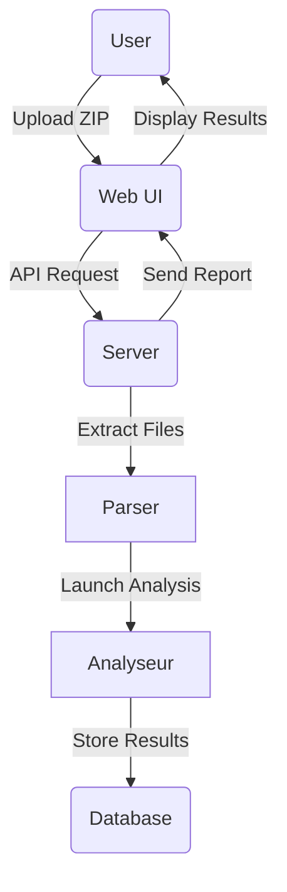

# `Dev` // SafeCode Documentation

# Introduction
This documentation is for current or future developers. The purpose of it is to explain how the SafeCode project has been architected, how it has been created, how it works and how to add functionalities.

# Technologies used
- Go (Classic + Gin)
- Python (for AST conversion)
- MongoDB (Atlas)
- Docker

# Architecture
This architecture is currently in monolithic, here is the list of folders and their purpose: 
1. `ast`
2. `doc`
3. `src_analyser`
4. `src_parser`
5. `src_server`

# Github
1. **The user must first be connected to SafeCode via GitHub**

2. **The user enters the GitHub URL of his repo (HTTPS, not SSH)**

3. **The frontend call an api with all the tokens to the backend**

4. **The backend manages the tokens it needs**

5. **The backend downloads the `.zip` via the Github API and places it in the `uplaods/` folder in the private area of the user**

6. **The analysis is then run as a traditional `.zip` file by the frontend**
