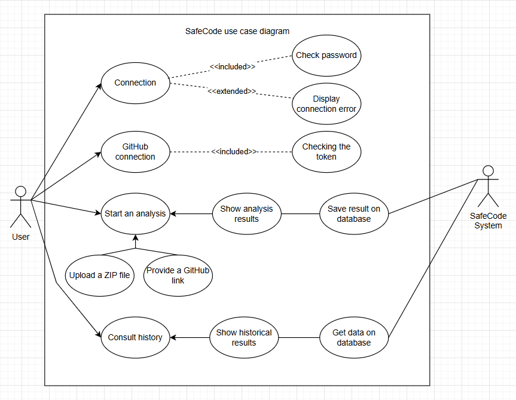

# `Dev` // SafeCode Documentation

# Introduction
This documentation is for current or future developers. The purpose of it is to explain how the SafeCode project has been architected, how it has been created, how it works and how to add functionalities.

# Technologies used
- Go (Classic + Gin)
- Python (for AST conversion)
- MongoDB (Atlas)
- Docker

# User path


# Architecture
This architecture is currently in monolithic.
## Graphic


## Explanation
### 1. Ast
**Folder name:** `ast/`<br>
This folder is used to put all the code converters in AST. To convert a language we use the original language itself.<br>
The code will be called by the parser, the file name will be passed as an argument and the code will return the AST in the form of a `.json` file.

### 2. Json
**Folder name:** `doc/`<br>
This file contains all the rules that have been created and can be analysed.<br>
The model we use is :<br>
```
CWE-[number]/
   rule[1].json
```
Example of `.json` :<br>
```json
{
  "schema": {
    "dangerous_functions": [
      [
        "int",
        ["value.func.id"]
      ]
    ],
    "safe_functions": [
      [
        "str.isdigit",
        ["value.func.attr"]
      ]
    ]
  },
  "ToFixIt": {
    "text": "Validate query parameters before using them. Use methods like .isdigit() or regex to ensure proper types."
  },
  "Kind": {
    "text": "Improper Input Validation (CWE-20)"
  },
  "Doc": {
    "what_is_an_issues": "User input is directly cast to an integer without validation. If the input is not a valid number, it can raise a runtime error, causing the app to crash or behave unpredictably.",
    "how_can_i_fix_it": "Always validate input using safe type checks before converting types. In this case, check if the input is a digit before using int().",
    "more_info": "https://cwe.mitre.org/data/definitions/20.html"
  }
}
```
The .json files contain ‘dangerous’ and ‘safe’ functions with their name and path in the AST.
If a dangerous function is detected and then the safe function (or just the safe), nothing will happen. But if there is only the dangerous function, then the vulnerability is recorded.

### 3. Logic server
**Folder name:** `src_server/`<br>
**Port:** `8080`<br>
**Endpoints:**<br>

The SafeCode backend runs on port 8080 using the Gin framework.<br>
It exposes several endpoints grouped into two categories: authentication and protected actions (requiring a valid token).

#### 🔑 Authentication Endpoints

| Method | Path                    | Description                                 |
|--------|--------------------------|---------------------------------------------|
| GET    | `/auth/github`            | Redirects the user to GitHub for OAuth login. |
| GET    | `/auth/github/callback`   | Handles the OAuth callback from GitHub and retrieves the access token. |
| POST   | `/auth/register`          | Registers a new user with email and password. |
| POST   | `/auth/login`             | Logs a user in and returns a JWT token. |
| POST   | `/logout`                 | Logs the user out by invalidating their token (handled client-side). |

#### 🔒 Protected Endpoints (require authentication)

| Method | Path                      | Description                                 |
|--------|----------------------------|---------------------------------------------|
| GET    | `/users`                   | Retrieves the list of all registered users. |
| GET    | `/me`                      | Retrieves the profile of the authenticated user. |
| POST   | `/upload`                  | Uploads a ZIP file for analysis. |
| POST   | `/analyse`                 | Starts the analysis process on an uploaded file. |
| GET    | `/analyse/history`         | Retrieves the analysis history of the user. |
| POST   | `/github/download`         | Downloads and extracts a GitHub repository based on a provided link. |

#### 🛡️ Security and Middleware
- All protected routes use a JWT authentication middleware (`AuthMiddleware`).
- CORS policy allows all origins and methods to facilitate communication with the frontend.

### 4. Logic parser
**Folder name:** `src_parser/`

### 5. Logic analyser
**Folder name:** `src_analyser/`  

### 6. Docker
**Folder name: `docker-compose.yml & Dockerfile`**

# Frontend

# GitHub Integration Guide

This documentation explains how to integrate GitHub authentication and access into your Go project.

---

## 1. Create a GitHub OAuth Application

To allow users to log in via GitHub, you need to create an OAuth application on GitHub:

1. Go to [GitHub Developer Settings](https://github.com/settings/developers)
2. Click on **"New OAuth App"**
3. Fill in the fields:
   - **Application name**: `Safecode`
   - **Homepage URL**: `http://localhost:3000`
   - **Authorization callback URL**: `http://localhost:3000/auth/github/callback`
4. Click **"Register application"**
5. Copy the **Client ID** and **Client Secret**

---

## 2. Environment Configuration

Store your GitHub credentials in your `.env` file:

```env
GITHUB_CLIENT_ID=your_client_id
GITHUB_CLIENT_SECRET=your_client_secret
```
Make sure your Go application loads this .env file

3. **Create two routes**
   - 'auth/github' to redirect on Github Authentification page
   - 'auth/github/callback to come back on the application after Github Autorization
     
  After **callback**, the user is authenticated on the application and has a Github access Token.
  This Access Token is mendatory to use Github User's data, like repository or organisation.
  See the Github API documentation, to see al 
  
4. **GitHub Integration in This Project**
In this project, GitHub is used to allow the user to test a repository's code directly inside the app:

  - The user provides the HTTPS URL of a GitHub repository.
  - The app fetches the repository code and executes analysis or testing.
  - The GitHub Access Token is used to access private repositories if needed.

5. **Useful Links**
  - GitHub OAuth Apps Documentation
  - GitHub REST API Docs
  - godotenv (for loading .env in Go)

6. **Notes**
  - Don't forget to protect your .env file — never commit it to your repository.
  - You can store the access token in a session, database, or JWT, depending on your auth strategy.
  - Rate limiting applies to GitHub API requests. Use appropriate headers or tokens.
