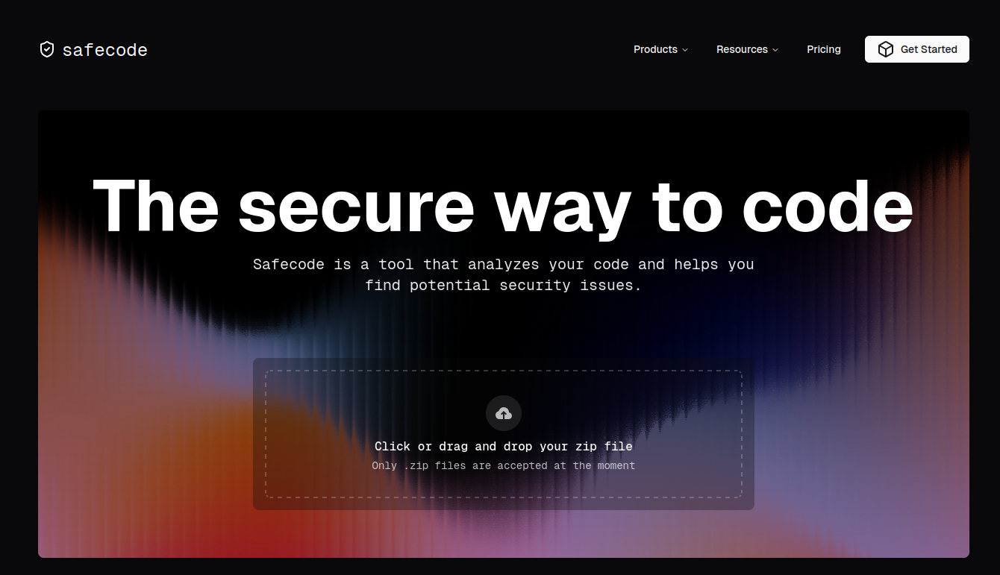

# `Non technical` // Documentation SafeCode

## Introduction
Safe code is a SaaS web application that detects vulnerabilities in source code sent by the user in `.zip` format. Weaknesses are displayed, along with advice on how to resolve them and the sources of the detections.

## Main functionalities
- Secure connection
- Upload .zip file
- Automatic code analysis
- Clear, interactive reporting
- Python and C# (in the future) support

## QuickStart
### - Go to the SafeCode website
### - Click on `Get Started`
 
### - Create an account and log in
 

### - If you are not already in it, click on `Go to dashboard`
### - Click or drag and drop your `.zip` file
 
### - View your report

## Pricing
| Level 1                        | Level 2                       | Level 3                          |
|----------------------------------|----------------------------------|----------------------------------|
|  |  |  |

### - Free
Downloadable from our website. The versions available will always be one or two versions behind the last one.  
(Level 1 technical documentation becomes accessible).

### - Team
Downloadable from our website. The price will be the basic price and will increase according to the number of lines of code analysed during the month. 
(Level 2 technical documentation becomes accessible).

### - Enterprise
Please contact us to discuss your requirements and the possibility of installing SafeCode locally in your infrastructure. 
(Level 3 technical documentation becomes accessible).

## FAQ
### **- My zip doesn't work**
→ Check your connexion and you are logged well. 
→ Check that it is not empty or corrupted. 
→ Is it a real `.zip` and not with an hiden dot? 

### **- The report doesn't detect anything**
→ Is your language supported? 
→ Check your licence. 
→ Are you too good in code? 

### **- Is it secure?**
→ All the code we keep is encrypted, so we don't have access to it. 
→ We only keep the last analyse, never the others. 
